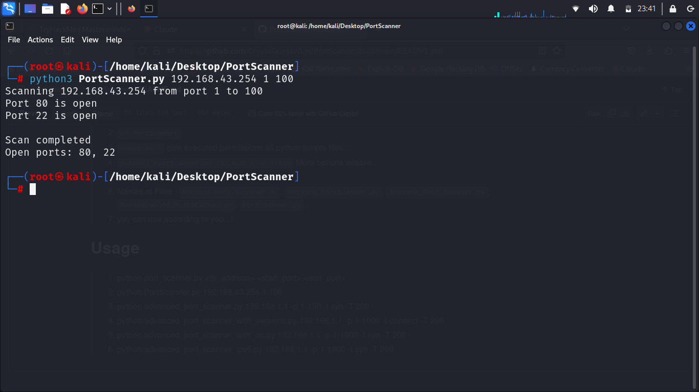
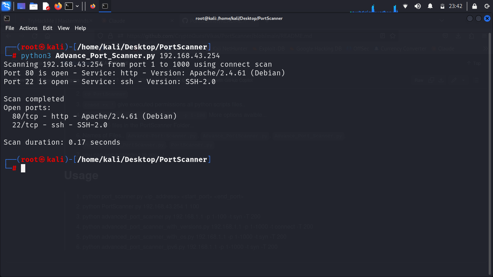
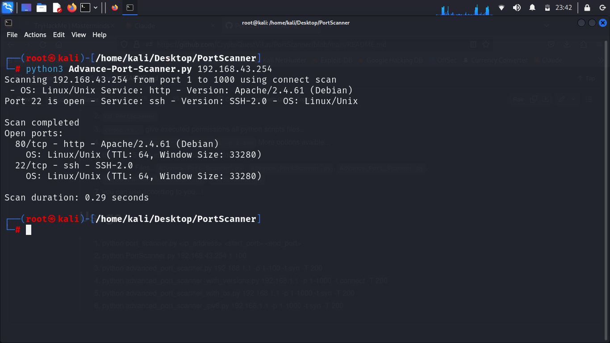
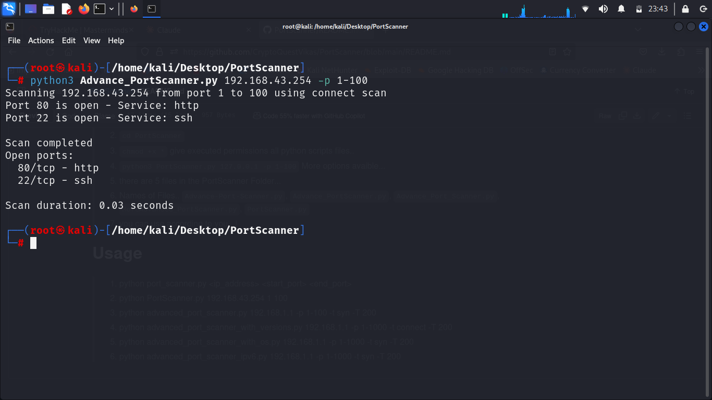
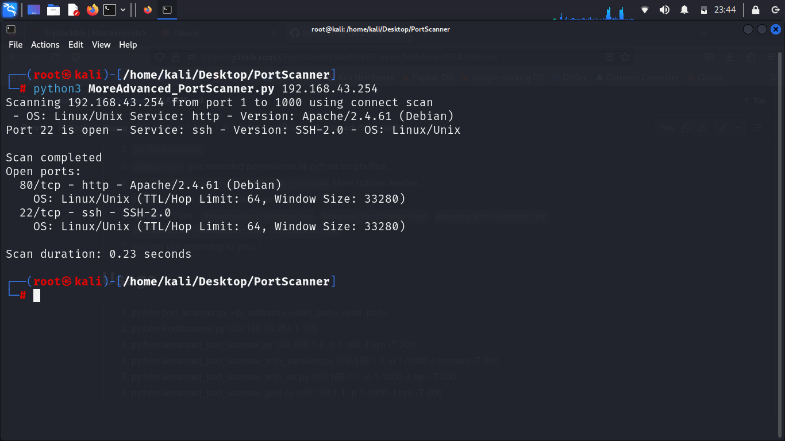

# PortScanner
## What is Port Scanner ?
### answer :
```
A port scanner is a software tool used to probe a network host for open ports. It's an essential instrument in network security and administration, helping to identify which ports on a computer or server are accessible and potentially vulnerable to attacks.

Port scanners work by sending packets to specific ports on a target system and analyzing the responses. Open ports will typically respond, while closed ones may not reply or send back an error message. This process allows network administrators to map out the "attack surface" of a system, identifying services that may be unnecessarily exposed.

Common types of port scans include TCP connect scans, SYN scans, and UDP scans. More advanced scanners can also attempt to determine the operating system and versions of services running on open ports.

While port scanners are legitimate tools for network diagnostics and security assessments, they can also be misused by attackers to gather information for potential exploits. As such, the use of port scanners is often monitored and may be restricted in some networks.

Ethical use of port scanners requires permission from the network owner. They're frequently employed in vulnerability assessments, network inventory, and compliance checks, playing a crucial role in maintaining robust cybersecurity defenses.
```

> 1. ``git clone https://github.com/CryptoQuestVikas/PortScanner.git``
> 2. ``cd PortScanner``
> 3. ``chmod +x *`` give executed permissions all python scripts files..
> 4. ``python3 PortScanner.py 127.0.0.1 -p 1-100`` More options avaible...
> 5. there are 5 files in the PortScanner Folder...
> 6. Names of Files..  ``Advance-Port-Scanner.py``, ``Advance_PortScanner.py``, ``Advance_Port_Scanner.py``, ``MoreAdvanced_PortScanner.py``, ``PortScanner.py``
> 7. you can use according to you...!

# **Usage**
> 1. python port_scanner.py <ip_address> <start_port> <end_port>
> 2. python PortScanner.py 192.168.43.254 1 100
> 3. python advanced_port_scanner.py 192.168.1.1 -p 1-100 -t syn -T 200
> 4. python advanced_port_scanner_with_versions.py 192.168.1.1 -p 1-1000 -t connect -T 200
> 5. python advanced_port_scanner_with_os.py 192.168.1.1 -p 1-1000 -t syn -T 200
> 6. python advanced_port_scanner_ipv6.py 192.168.1.1 -p 1-1000 -t syn -T 200

# **Screenshots :**





